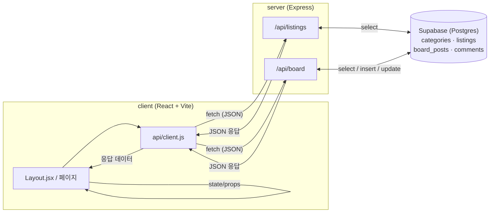

# 캠퍼스핏 (CampusFit)

흩어진 장학금·지자체혜택·대외활동·인턴십 정보 중, 지역·학년 조건에 맞는 것만 걸러
보여주는 대학생 정보 플랫폼. 팀 단위 공고는 인앱 팀원모집 게시판(댓글 지원)으로 실제 지원까지
이어지게 한다.

기획 배경은 [기획서.md](기획서.md), 코드 컨벤션·디렉토리 구조는 [CLAUDE.md](CLAUDE.md) 참고.

## 실행 방법

두 터미널에서 각각 실행 (서버 먼저 켜야 클라이언트가 데이터를 받아온다).

```bash
cd server && npm install && npm run dev   # http://localhost:4000
```

```bash
cd client && npm install && npm run dev   # http://localhost:5173
```

## 아키텍처

화면(React)이 서버(Express)에 요청하고, 서버가 Supabase(Postgres)를 조회·갱신해서 응답한다.
화면은 DB에 직접 접근하지 않는다.



**읽기 흐름**: `Layout.jsx`가 마운트 시 `api.getCategories()` · `api.getListings()` ·
`api.getBoardPosts()`를 호출 → 각 라우트가 Supabase에서 조회 → JSON으로 응답 → `Layout.jsx`가
Outlet context로 하위 페이지에 내려준다.

**쓰기 흐름 (수직슬라이스 예시 — 팀원모집 글쓰기)**: 게시판 화면에서 글쓰기 제출 →
`api.addBoardPost()` → `POST /api/board` → Supabase `board_posts` 테이블에 insert → 저장된
row를 다시 조회해 응답 → 화면이 응답으로 목록 state를 갱신. 모집완료 처리(`PATCH
/api/board/:id/status`)도 같은 패턴으로 동작한다.

## 데이터 소스

- **한국장학재단**: 공공데이터포털 API 연동 완료 (`server/src/db/sync-kosaf.js`, `npm run
  db:sync-kosaf`). 지역 매칭은 광역시도명 키워드 기반이라, 시/군 단위로만 지역이 언급된 지자체
  장학금은 아직 놓칠 수 있다 (전국 시/군/구 → 광역시도 매핑 테이블 필요, 진행 중).
- **온통청년**: API 키는 승인됐으나 리다이렉트되는 서버 포트가 응답하지 않아 연동 보류.
- **대외활동 · 인턴십**: 아직 mock 데이터, 다음 단계에서 실데이터 연동 예정.
