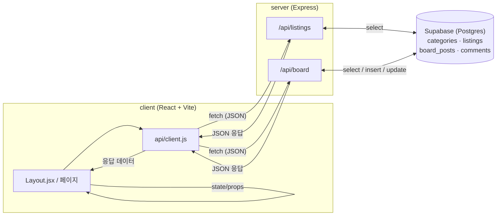

# 캠퍼스핏 (CampusFit)

흩어진 장학금·지자체혜택·대외활동·인턴십 정보 중, 지역·학년 조건에 맞는 것만 걸러
보여주는 대학생 정보 플랫폼. 팀 단위 공고는 인앱 팀원모집 게시판(댓글 지원)으로 실제 지원까지
이어지게 한다.

기획 배경은 [기획서.md](기획서.md), 코드 컨벤션·디렉토리 구조는 [CLAUDE.md](CLAUDE.md) 참고.

## 실행 방법

두 터미널에서 각각 실행 (서버 먼저 켜야 클라이언트가 데이터를 받아온다).

```bash
cd server && npm install && npm run dev   # http://localhost:4000
```

```bash
cd client && npm install && npm run dev   # http://localhost:5173
```

## 아키텍처

화면(React)이 서버(Express)에 요청하고, 서버가 Supabase(Postgres)를 조회·갱신해서 응답한다.
화면은 DB에 직접 접근하지 않는다.



**읽기 흐름**: `Layout.jsx`가 마운트 시 `api.getCategories()` · `api.getListings()` ·
`api.getBoardPosts()`를 호출 → 각 라우트가 Supabase에서 조회 → JSON으로 응답 → `Layout.jsx`가
Outlet context로 하위 페이지에 내려준다.

**쓰기 흐름 (수직슬라이스 예시 — 팀원모집 글쓰기)**: 게시판 화면에서 글쓰기 제출 →
`api.addBoardPost()` → `POST /api/board` → Supabase `board_posts` 테이블에 insert → 저장된
row를 다시 조회해 응답 → 화면이 응답으로 목록 state를 갱신. 모집완료 처리(`PATCH
/api/board/:id/status`)도 같은 패턴으로 동작한다.

## 데이터 소스

- **한국장학재단**: 공공데이터포털 API 연동 완료 (`server/src/db/sync-kosaf.js`, `npm run
  db:sync-kosaf`). 지역 매칭은 광역시도명 키워드 기반이라, 시/군 단위로만 지역이 언급된 지자체
  장학금은 아직 놓칠 수 있다 (전국 시/군/구 → 광역시도 매핑 테이블 필요, 진행 중).
- **온통청년**: 연동 완료 (`server/src/routes/youthPolicy.js`). DB에 저장하지 않고 요청마다
  실시간으로 외부 API를 호출해 지자체 혜택·대외활동·인턴십 3개 카테고리에 자동 분류해서
  listings와 합쳐 내려준다.
- **1365 자원봉사**: 인증키는 정상 승인됐으나(API가 `resultCode: 00 NORMAL SERVICE` 응답)
  파라미터를 뭘 넣어도 데이터가 0건이라 원인 문의 중 — 2026년 자원봉사기본법 개정과 맞물려
  구 엔드포인트가 죽었을 가능성이 있다.
- **워크넷(고용24)**: 개인은 사업자등록번호 없이 고용24 자체 회원가입이 안 돼서 보류.
- **대외활동 · 인턴십 일부, 공모전**: 공모전은 지역/학년 필터 효과가 적고 공공데이터포털에
  오픈 API도 없어 2026-07-28에 카테고리 자체를 제거했다. 나머지 mock 데이터는 다음 단계에서
  실데이터로 교체 예정.

## 제작 과정

기획부터 지금까지 실제로 어떤 순서로 만들었는지 남긴 기록. (날짜는 hub 저장소 PR 병합·campusfit
저장소 커밋 기준)

- **2026-07-07 ~ 07-08**: 기획서 작성, 첫 컴포넌트 개발.
- **2026-07-09**: React + Express 개발환경 구성. 프로토타입 웹 레이아웃 재설계, 팀원모집
  게시판 추가.
- **2026-07-10**: 4주 개발 Task 백로그 작성.
- **2026-07-14**: 디자인 전면 개편 — oklch 인디고 팔레트, 헤더 드롭다운 필터, 리스팅 상세
  화면 도입(design-system.md 원칙 7을 뒤집는 결정).
- **2026-07-15**: 관심분야를 "우선 정렬"에서 카테고리 목록 화면의 실제 필터로 바꾸고,
  북마크를 MVP 이후에서 앞당겨 로그인 없이 `localStorage`로 구현.
- **2026-07-16 ~ 07-20**: SQLite(better-sqlite3)로 DB 연결, React 화면을 API 연동으로 전환.
- **2026-07-21**: SQLite에서 Supabase(Postgres)로 DB 전환.
- **2026-07-22**: 한국장학재단 실데이터 연동, 매칭 이유 표시 기능 추가.
- **2026-07-23**: 온통청년 API 키 승인 — 다만 당시 엔드포인트가 응답 없는 포트로 리다이렉트되어
  연동 보류.
- **2026-07-27**: 온통청년을 다른 엔드포인트(`/go/ythip/getPlcy`)로 다시 연동해 지자체
  혜택·대외활동·인턴십에 실데이터 반영.
- **2026-07-28**: 공모전 카테고리 제거(mock 데이터·Supabase·문서 전부 동기화, 삭제 전
  백업은 `server/src/db/backups/`). 워크넷·1365 자원봉사 API 연동을 시도했으나 워크넷은
  사업자등록 필요로 보류, 1365는 원인 불명의 응답 0건 문제로 고객센터 문의 중. 2주치 밀려
  있던 커밋을 정리해서 push.
