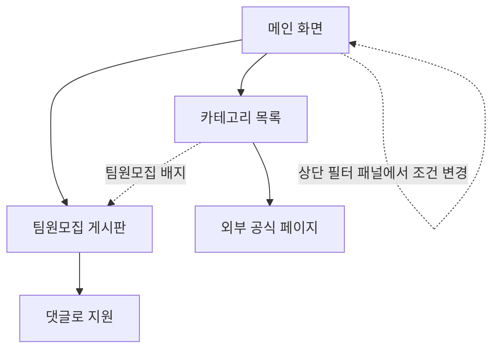

# 캠퍼스핏 (CampusFit) — 지원 가능한 공고만 자동으로 보여주는 대학생 정보 플랫폼

> 학생은 자신의 조건만 입력하면, 지원 가능한 공고만 남는다.

N010_권소현 · 기획서

---

## 1. 문제 정의

학과 · 선후배 네트워크가 약한 대학생은 장학금 · 공모전 · 지자체 혜택 · 대외활동 · 인턴십 정보가
여러 사이트에 흩어져 있고, 학교 · 지역 · 학년에 따라 지원 대상이 달라지는 상황에서 자신에게
해당되는 기회의 존재조차 모른 채 놓친다.

**정보가 없는 게 아니라, 카테고리마다 사이트가 갈라져 있고, 그중 어디도 "내가 대상인지"를
걸러주지 않는다는 것이 문제의 본질이다.**

**AI 챗봇에 물어보면 되지 않을까?**

| | AI 챗봇 | 캠퍼스핏 |
|---|---|---|
| 정보 출처 | 어디서 가져왔는지 알기 어렵다 | 공식 공고만 수집한다 |
| 최신성 | 마감 지난 공고를 그대로 알려줄 수 있다 | 마감된 공고는 자동으로 삭제된다 |
| 자격 확인 | 내가 대상인지는 결국 직접 다시 확인해야 한다 | 국립/사립 · 지역 · 학년 조건으로 자동 필터링된다 |

**기존 사이트를 쓰면 되지 않을까?** — 사이트마다 다루는 카테고리가 다르다.

| 서비스 | 다루는 카테고리 | 자격 필터 | 팀원모집 |
|---|---|---|---|
| 링커리어 | 대외활동 · 공모전 · 교육 · 채용 | 지역 · 분야 수동 필터 | 공고별로 있음 (글쓰기 + 댓글 + 전용 채팅방) |
| 캠퍼스픽(에브리커리어) | 동아리 · 대외활동 · 공모전 · 취업 · 교육 | 학교별 / 지역 필터 | 스터디 게시판 (특정 공고와 무관한 자유 모집) |
| 위비티 | 공모전 전용 (대외활동은 공모전 안 분류 태그) | 없음 | 없음 |
| 드림스폰 | 장학금 전용 | 없음 (해시태그만) | 없음 |
| 스펙업 | 네이버 카페 커뮤니티 (공모전 · 인턴 큐레이션) | 없음 | 없음 |
| 워크넷 | 채용 · 인턴 중심 (정부) | 조건 검색은 있으나 대학생 특화 아님 | 없음 |
| 에브리타임 | 학교 내부 커뮤니티, 외부 공고 없음 | - | 일반 팀원모집 · 스터디 (교내 한정) |

이 5개 카테고리를 한 곳에서, 국립/사립 · 지역 · 학년 조건으로 자동 필터링해서 보여주는 서비스는
없다.

- **기존 방식**: 장학금(1개 사이트) + 공모전(1개 사이트) + 대외활동(1개 사이트) + 인턴(1개 사이트)
  + 지자체 혜택(1개 사이트) = 최소 5개 사이트를 각각 방문해서, 자격 조건까지 직접 확인해야 한다.
- **캠퍼스핏**: 학교 유형 · 지역 · 학년을 한 번 입력하면, 지원 가능한 공고만 한 번에 모여서 보인다.

**5번의 탐색을 1번으로 줄인다.**

---

## 2. 타겟 유저

**정보 경로가 끊긴 학생 — 신입생 · 편입생 · 복학생**

학과 네트워크가 약해 정보를 스스로 찾아야 하는 대학생 중에서도, 정보 경로가 한 번 끊겨 처음부터
다시 모아야 하는 신입생 · 편입생 · 복학생을 첫 타겟으로 삼는다. 최종적으로는 거의 모든 대학생이
쓸 수 있는 서비스를 지향하지만, 첫 타겟을 좁게 잡아야 그 사람들에게 확실히 꽂히고 거기서부터
퍼진다고 보고 초기 타겟은 좁게 유지한다.

---

## 3. 사용자 시나리오

1. **메인 화면 진입** — 별도의 온보딩 절차 없이, 들어오자마자 전체 카테고리와 목록이 바로 보인다.
2. **필터 설정** — 화면 상단에 상시 노출된 필터 패널에서 국립/사립 · 지역 · 학년을 선택하면,
   선택하는 즉시 목록이 좁혀진다. 별도의 "확인" 버튼이나 단계 전환은 없다.
3. **카테고리 목록 확인** — 장학금 · 공모전 · 지자체 혜택 · 대외활동 · 인턴십 중 원하는 카테고리로
   들어가면, 마감 임박 공고와 최근 등록된 공고가 상단에, 전체 목록이 그 아래 이어진다. 팀 단위로만
   지원 가능한 공고에는 "팀원모집 N건" 배지가 함께 보인다.
4. **지원** — 일반 공고는 공식 페이지로 이동해 지원한다. 팀원모집 배지가 있는 공고는 그 공고에
   연결된 인앱 게시판으로 들어가, 모집글을 올리거나 댓글로 지원한다.
5. **재방문** — 한 번 설정한 필터 값은 저장되어 다음 접속부터 자동 적용되고, 언제든 상단 패널에서
   바로 바꿀 수 있다.

---

## 4. 핵심 기능

### 01. 카테고리 통합 자격 필터링

국립/사립 + 지역 + (해당하는 경우) 학년 조건으로, 장학금 · 공모전 · 지자체 혜택 · 대외활동 ·
인턴십 5개 카테고리를 한 번에 필터링한다. 문제 정의를 정면으로 해결하는 서비스의 심장이자,
어떤 경쟁 서비스도 하지 않는 기능이다.

예를 들어 "사립대 · 강원 지역 · 2학년" 조건만 입력하면, 수백 개 공고 중 이 조건으로 지원
가능한 것만 남는다 — 이게 "자격 자동 판별"이며 서비스가 존재하는 이유다.

학년 조건은 필터에 항상 포함하되, 공고에 학년 조건이 실제로 있는 경우에만 작동한다. 장학금 ·
인턴십처럼 학년별 자격이 갈리는 카테고리에서는 정확도를 높이고, 학년이 무관한 카테고리에는
필터를 강제하지 않는다.

소득분위처럼 사람마다 다르고 공적 자료로 확인이 필요한 세부 조건은 필터링 대상에 넣지 않는다.
대신 공고 안에 조건을 그대로 표시해서 학생이 직접 확인하게 한다 — 필터 항목이 늘어날수록 정확도가
아니라 온보딩 피로만 늘어난다는 판단이다.

### 02. 마감 임박 + 신규 등록 정리

필터링된 결과 안에서, 마감까지 7일 이내 남은 공고를 전부 상단에 모아 놓치지 않게 한다. 같은
자리에 최근 등록된 공고도 함께 보여준다 — 등록일은 이미 갖고 있는 데이터라 별도 기능 추가 없이,
"이번 주에 뭐가 새로 올라왔는지" 보러 다시 들어올 이유를 만든다. 스크랩 · 알림처럼 무거운 기능
없이, 정렬 기준 하나만 더하는 것으로 충분하다.

### 03. 팀원모집 게시판

필터링된 공고 중 팀 단위 지원이 필요한 것에 한해, 그 공고에 연결된 인앱 게시판에서 학생이
모집글을 올리고 댓글로 지원한다. 게시판이 카테고리 전체를 아우르는 범용 자유게시판이 아니라
개별 공고 단위로 연결된다는 점이 핵심이며, 이는 01번 필터링 기능과 이어져 있을 때만 의미가 있다.
실시간 채팅 같은 부가 기능은 MVP 범위 밖으로 두고, 글쓰기 + 댓글 지원까지만 만든다.

에브리타임 · 오픈채팅 · 디스코드도 사실상 팀원모집의 경쟁자다. 이들과의 차이는 "게시판이 있다"가
아니라 "공고 하나하나에 팀원모집이 연결돼 있다"는 것이다 — 범용 커뮤니티에서는 원하는 공고의
모집글을 찾으려면 직접 검색해야 하지만, 캠퍼스핏은 공고에서 곧바로 그 팀원모집으로 이어진다.

---

## 5. 운영 로직

- **정보 출처**: 공모전 사이트, 한국장학재단, 지자체, 대외활동 주최 기관이 직접 게시한 공고를
  수집해 정리한다.
- **MVP 수집 범위**: 장학금 · 공모전 · 지자체 혜택 · 대외활동 · 인턴십을 다루는 출처는 각각
  수백 곳에 달해서, 처음부터 다 모으는 건 현실적이지 않다. MVP는 카테고리별 상위 출처 몇 곳으로
  범위를 한정한다 — 예를 들어 장학금은 한국장학재단 + 지역 장학재단 상위 5곳, 공모전은 링커리어 ·
  위비티에 등록된 것 중 대학생 대상만. 출처를 늘리는 건 MVP 검증 이후의 일이다.
- **마감 처리**: 마감된 공고는 자동으로 목록에서 사라진다.
- **마감일 갱신**: 마감일이 변경되면 주최 측이 올린 변경 공지를 기준으로 정보를 갱신한다.

---

## 6. 일부러 하지 않는 것

| 결정 | 이유 |
|---|---|
| 별도의 온보딩 화면을 두지 않는다 | 콘텐츠 진입 전에 통과해야 하는 설문 단계는, 화면을 넓게 만들어도 결국 앱 온보딩 위저드처럼 보인다. 필터는 콘텐츠 위에 얹힌 상시 컨트롤로 둔다 |
| 학과 필터는 넣지 않는다 | 다른 분야를 탐색할 가능성을 열어두려고 — 관심분야는 필터가 아닌 우선 정렬로만 쓴다 |
| 지역 기준은 재학 학교 소재지 | 거주지 기준은 변수가 많아 복잡해진다. 학교 소재지는 한 번만 정하면 되는 단순한 기준이다 |
| 복수전공 · 편입 이력은 고려하지 않는다 | 학과 단위가 아니라 대학생 전반이 알아두면 좋은 정보를 다루는 서비스이기 때문이다 |
| 개인 알림(푸시 · 문자)은 두지 않는다 | 정보를 모아 필터링해 보여주는 사이트이지, 알아서 챙겨주는 비서형 서비스가 아니다 |

---

## 7. MVP 이후 확장 기능

최소 기능 제품(MVP)이 검증된 다음, 순서를 정해 붙여나갈 기능들.

- 카테고리 내 검색
- 스크랩 · 북마크
- 합격 후기 · 커뮤니티
- 자소서 · 서류 템플릿
- 필터 항목 확장 — 관심분야 · 보유 기술 · 전공 · 온라인/오프라인 여부 · 활동 기간. 대학생들이
  실제로 많이 보는 조건이지만, MVP는 국립/사립 · 지역 · 학년 세 가지로 의도적으로 제한한다.
  필터가 늘어날수록 온보딩 피로가 정확도 개선보다 커진다는 판단([핵심 기능 01](#4-핵심-기능)
  참고)이라, 검증 후 순서를 정해 붙인다.

**더 먼 단계 아이디어 (검증 안 됨)**

- 조회 기록 기반 추천 — 예를 들어 공모전을 많이 본 학생에게 비슷한 공모전을 보여주는 것. AI 없이
  관심분야 · 북마크 데이터만으로도 시작할 수 있지만, 행동 추적과 유사도 로직이 새로 필요해서
  "필터링 하나만 잘하자"는 MVP 원칙과는 결이 다르다. 확장 기능보다 뒤에 두고, MVP가 검증된 다음
  별도로 재검토한다.

---

## 8. 화면 흐름

## 9. 화면 구성

- **메인 화면**: 상단에 상시 필터 패널(국립/사립 · 지역 · 학년, 접었다 펼 수 있음) + 카테고리
  5개 카드 + 팀원모집 탭 + 전체 카테고리를 합친 마감임박 상위 목록. 필터를 안 정해도 바로 둘러볼
  수 있다.
- **카테고리 목록**: 상단 '마감 임박' 코너(7일 이내) + 전체 목록 (제목 / 한 줄 요약 / 마감일 /
  링크 / 팀원모집 배지).
- **팀원모집 게시판**: 모집글 목록 (제목 / 연결 공고 / 모집 인원 / 마감일 / 상태) + 댓글로 지원.

---

## 10. 프로토타입

클릭해서 넘겨보는 프로토타입: [`design/prototype.html`](design/prototype.html). 순수 HTML/CSS로
만들어서 별도 서버 없이 파일을 그대로 열면 동작한다. 메인(필터 패널 + 통합 마감임박) · 카테고리
목록 5종 · 공고별로 연결된 팀원모집 게시판 · 지원 완료까지 실제로 화면이 전환되는 흐름을 확인할
수 있다. 데이터는 목데이터지만 인터랙션은 실제로 동작한다.

다음 단계는 이 프로토타입의 구조를 참고해 `client/src`에 실제 React 컴포넌트로 구현하고, 목데이터를
Supabase 연동으로 교체하는 것이다.

---

## 11. 결정이 필요한 것

- **DB**: 지금은 `server/src/data/seed.js` 더미 배열. Supabase 테이블로 옮기는 작업이 필요하다.
- **로그인 / 계정**: 댓글 지원에 "누가" 썼는지 구분하려면 최소한의 세션 / 닉네임이 필요한지 정해야 한다.
- **배포**: 로컬 개발만 세팅된 상태, 배포 플랫폼 미정.
- **팀원모집 상태 변화**: 모집 완료된 글을 어떻게 표시할지.
- **공고 자동 수집**: 한국장학재단 · 청년정책처럼 공공데이터포털 API가 있는 곳부터 자동 연동하고,
  공모전처럼 API가 없는 곳은 크롤링 / 수동으로 시작하는 걸 검토 중이다. 원문 상세페이지로 바로
  연결하려면 소스 데이터에 링크 필드가 있어야 하고, DB 스키마(출처 · 원문링크 · 최종수집일시)도
  이 결정에 달려있다.
